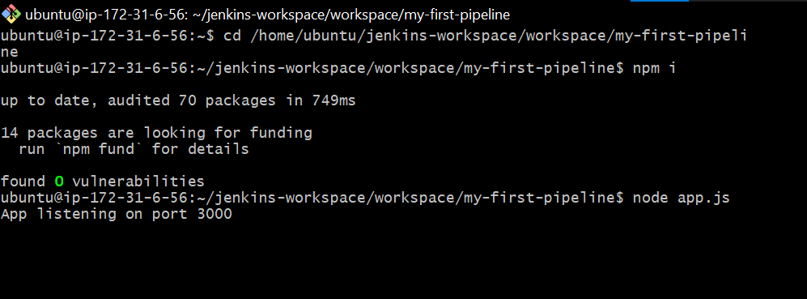

# 🛠️ **Jenkins Master-Agent Infrastructure & CI Pipeline**

## 📘 Class Work

---

### 🌐 Setting Up the Infrastructure

#### 🔒 Creating Security Groups for EC2 Instances

 

 

---

#### 🖥️ Creating EC2 Instances

 

 

---

### 🎛️ Setting Up the Jenkins Master

#### 🔐 SSH into the Master Node & Install Java + Jenkins

 

 

---

#### 🧭 Jenkins Master Dashboard

 

 

---

#### 🛰️ Jenkins Agent Node

 

 

---

### 🏗️ Architecting for Scale — Setting Up a Jenkins Agent

#### 🔑 Generating Global SSH Credentials

 

 

---

#### 🧩 Creating Agent Nodes

 

 

---

## 📘 Home Assignment

---

### 💻 The Application — Creating Our Sample Code

#### 🌀 Code Pushed to GitHub

 

 

---

### 🔁 Continuous Integration with Jenkins

#### 📋 Console Output After Build Trigger

 

 

---

#### 🧪 CI Pipeline Running

 

 

---

#### 🟢 Pipeline In Progress / Running Status

 

 

---
